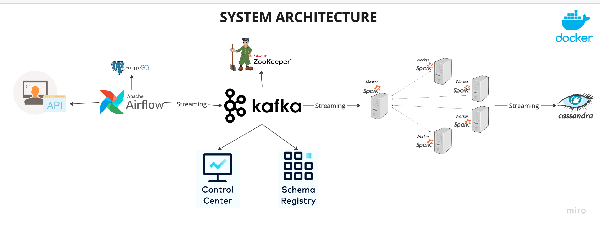

# Realtime Data Streaming | End-to-End Data Pipeline
_________________________________________________________________________________________________________________________________________

##### Table of Contents
_________________________________________________________________________________________________________________________________________

- Introduction
- System Architecture
- Technologies/Tools
- Additional Details

###### Introduction 
_________________________________________________________________________________________________________________________________________

This project involved developing an end-to-end Data Engineering solution using Spark, Kafka, Airflow, Docker, Cassandra, and Python, automating data fetching from an API, routing it to Kafka using Airflow, and processing it with Spark Structured Streaming; stored results in Cassandra. Containerized all components with Docker for seamless integration and scalability.

###### System Architecture
_________________________________________________________________________________________________________________________________________

The pipeline desgined with following components:

Data Source: Utilizes the <randomuser.me> API to generate random user data as the primary data source.
Apache Airflow: Orchestrates the workflow, scheduling tasks to fetch data from the API and store it in a PostgreSQL database.
Apache Kafka and Zookeeper: Streams data from PostgreSQL to the processing engine for real-time data flow, with Zookeeper managing Kafka cluster configurations.
Control Center and Schema Registry: Monitors Kafka streams and manages schemas, ensuring data integrity and compliance.
Apache Spark: Processes data efficiently using its master and worker nodes, transforming incoming data for storage.
Cassandra: Acts as the final storage solution for processed data, providing scalability and high availability.

###### Technologies
_________________________________________________________________________________________________________________________________________

- Apache Airflow: 2.6.0 for workflow orchestration
- Python: >= 3.9 for scripting and data manipulation
- Apache Kafka: For data streaming
- Apache Zookeeper: For Kafka cluster management
- Apache Spark: 3.4.1 for distributed data processing
- Cassandra: For storing processed data
- PostgreSQL: 14.0 for initial data storage
- Docker: For containerization, ensuring seamless deployment and scalability
- Java: 11.0.22 for running Java-based components
- Scala: 2.12 for Spark and Kafka integration

Note: Setup the environment according to given dependencies. 

###### Additional Details 
_________________________________________________________________________________________________________________________________________

- Integrate Jars: (https://mvnrepository.com/artifact)
  - spark-cassandra-connector_2.12:3.4.1
  - spark-sql-kafka-0-10_2.12:3.4.1
  - kafka-clients-3.4.1.jar